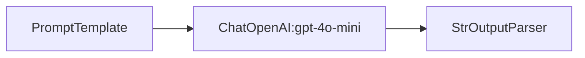

# Lesson 1: Hello, Chain (Prompt → LLM → Parser)

## Overview

This lesson introduces the fundamental LangChain pattern: **PromptTemplate → ChatModel → StrOutputParser**. You'll build your first chain, see it visualized in the course viewer, and understand how LangChain components work together.

**What you'll learn:**
- Core LangChain components: PromptTemplate, ChatModel, OutputParser
- How to trace and visualize LangChain flows with GraphJSON v1.1
- Real API usage with Groq (default) or OpenAI
- Reading visual flow diagrams in the course viewer

## Visual Flow Diagram

```
[Input Text] → [PromptTemplate] → [ChatModel] → [StrOutputParser] → [Summary]
```

**Nodes:**
- **PromptTemplate** (`promptTemplate`): Formats user input into a structured prompt
- **ChatModel** (`chatModel`): Language model that generates responses (Groq/OpenAI)
- **StrOutputParser** (`parser`): Ensures output is clean string format

**Edges:**
- Prompt → LLM: Formatted prompt text
- LLM → Parser: Raw model completion
- Parser → Output: Clean string result

## Setup

### Prerequisites

```bash
# Install dependencies (from repo root)
pip install -r requirements.txt
```

### Option 1: Groq (recommended - free tier)

```bash
export GROQ_API_KEY=... # from https://console.groq.com/keys
python3 lessons/01_hello_chain/code.py --text "Explain quantum computing briefly"
```

### Option 2: OpenAI

To use a real OpenAI model:

```bash
# Set your OpenAI API key
export OPENAI_API_KEY=sk-...

# Enable OpenAI mode
export USE_OPENAI=1

# Optional: Specify model (default: gpt-4o-mini)
export OPENAI_MODEL=gpt-4o-mini

# Run the lesson
python3 lessons/01_hello_chain/code.py --text "Explain quantum computing briefly"
```

## How to Run

### Basic Usage

```bash
# Groq (default)
export GROQ_API_KEY=...
python3 lessons/01_hello_chain/code.py --text "Explain machine learning"
```

### Real API Usage

```bash
# Set environment variables
export OPENAI_API_KEY=sk-your-key-here
export USE_OPENAI=1

# Run with real API
python3 lessons/01_hello_chain/code.py --text "Summarize the benefits of renewable energy"
```

### Expected Output

**Groq example:**
```
⚡ Using Groq API with model: llama3-8b-8192

📝 Result: ...
⏱️  Total latency: ...
💾 Saved GraphJSON: /path/to/lessons/01_hello_chain/graph.json
🎨 Saved Mermaid: /path/to/lessons/01_hello_chain/graph.mmd
✅ Lesson complete! Check graph.json and graph.mmd files.
```

## Generated Artifacts

### graph.json (GraphJSON v1.1)

Contains the complete visual flow with:
- **Metadata**: Version, run ID, timestamps, lesson ID
- **Nodes**: PromptTemplate, ChatModel, StrOutputParser with typed data
- **Ports**: Named input/output ports for each node
- **Edges**: Connections between nodes via ports
- **Events**: Timestamped execution steps (invoke_start/end)
- **Artifacts**: Prompt templates, resolved prompts, model outputs
- **Groups**: "hello_chain" group containing all three nodes

### graph.mmd (Mermaid Diagram)

A simple flowchart representation:


## Viewing Your Results

### Option 1: Course Viewer (Recommended)

```bash
# Start the viewer (from repo root)
cd viewer
npm install
npm run dev
```

Open http://localhost:3000 and:
1. Click "📊 Load Sample (Lesson 1)" OR
2. Use file upload to load `graph.json`

### Option 2: API + Viewer

```bash
# Start the API server (from repo root)
python3 -m uvicorn api.main:app --reload --host 127.0.0.1 --port 8000

# In another terminal, start the viewer
cd viewer && npm run dev
```

The viewer will automatically load the latest run via the API.

### Option 3: Mermaid Viewer

```bash
# Quick Mermaid preview (from repo root)
python3 -m uvicorn viz.serve_mermaid:app --reload --port 8080
```

Open http://127.0.0.1:8080

## Troubleshooting

### Common Issues

**"No module named 'langchain_openai'"**
```bash
pip install langchain-openai
```

**"OpenAI API key not found"**
- Verify: `echo $OPENAI_API_KEY`
- Ensure it starts with `sk-`
- Check if the key has sufficient credits

**"Network error" or timeout**
- Check internet connection
- Verify API key is valid and has credits
- Try again (sometimes OpenAI has temporary issues)

**Viewer won't load graph.json**
- Ensure the file was generated (check file modification time)
- Try refreshing the browser
- Check browser console for errors

### Fallback Behavior

No mock fallback. The lesson requires a real provider (Groq/OpenAI).

## Extension Ideas

### Easy Extensions

1. **Different Prompts:**
   ```bash
   python3 code.py --text "Explain blockchain technology"
   python3 code.py --text "Write a haiku about programming"
   ```

2. **Model Comparison:**
   ```bash
   export OPENAI_MODEL=gpt-3.5-turbo
   python3 code.py --text "Same input, different model"
   ```

3. **Prompt Template Variations:**
   Edit the template in `code.py`:
   ```python
   prompt = PromptTemplate.from_template("Explain {text} in simple terms for a beginner:")
   ```

### Advanced Extensions

1. **Add a Post-Processor:**
   - Insert a step after the parser to clean/format output
   - Practice adding nodes and edges to the tracer

2. **Multiple Output Formats:**
   - Try `JsonOutputParser` instead of `StrOutputParser`
   - Add schema validation

3. **Error Handling:**
   - Add try-catch around LLM calls
   - Use `tracer.error()` to record failures

4. **Performance Monitoring:**
   - Track token usage (`tracer.tokens_in`, `tracer.tokens_out`)
   - Measure latency for each component

## Key Concepts Learned

- **Chain Composition**: Sequential processing through multiple components
- **Visual Tracing**: GraphJSON captures both structure and execution flow
- **Mock vs Real**: Development workflow with fallback to mock services
- **Artifacts**: Rich metadata beyond just inputs/outputs
- **Ports & Edges**: Explicit connection points for complex flows

## Next Steps

- **Lesson 2**: Output Parsers and Robustness - structured outputs with error handling
- **Lesson 3**: RunnableSequence and Composition - building more complex chains
- **Module 2**: Memory and control flow for interactive applications

---

💡 **Pro Tip**: Keep the viewer open while running lessons to see your chains come alive visually!
